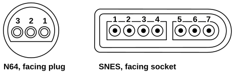

# SNES controller to N64 adapter

I'm a big fan of the "Bust-A-Move" series. I've played the SNES game with my "Score Master" arcade stick. I already had that at hand and it provides an "arcade-like" feeling while playing this classic arcade title. The successor titles "Bust-A-Move 2" and "Bust-A-Move 3" both were published for the N64 which either meant I had to use the regular N64 controller, get a new arcade stick or (and that's why this project came to live) need some adapter to use my "Score Master" on my N64.

This project heavily bases on the work done by @brownan in his [Gamecube-N64 Controller](https://github.com/brownan/Gamecube-N64-Controller) project. Without his assembler work, this project wouldn't have been possible!

# Materials

This is an extensive list of what's required.

- Any SNES controller you want to use on your N64
- An Arduino with an Atmega328 chip running at 16 MHz clock speed
- Gamecube and SNES extension cables to take the connectors from

# Quick setup

Figure 1: Pinout of the N64 plug and the SNES socket

##  Hooking the N64 to the Arduino

The N64 controller cord had 3 wires: ground, +3.3 V, and data. The pin-out is shown in Figure 1 (left).

1. +3.3 V (red) - connect to nothing
2. Data (white) - connect to Arduino digital I/O 8
3. GND (black) - connect to Arduino ground

## Hooking up the SNES controller to the Arduino

The SNES socket cord has 5 wires: 5V, clock, latch, data and ground. The pin-out is shown in Figure 1 (right).

1. 5V - connect to Arduino +5 V supply
2. Clock - connect to Arduino digital I/O A2
3. Latch - connect to Arduino digital I/O A1
4. Data - connect to Arduino digital I/O A3
5. Unused - connect to nothing
6. Unused - connect to nothing
7. GND - connect to Arduino ground

## Using it

You can upload the project to your Arduino using the Arduino IDE. Then connect the Arduino to both, your SNES controller and your N64 and provide power to the Arduino using the USB port.

## Final product

### Used components

I decided to use the Arduino Nano because it is very small and can be placed between the two connectors without taking up too much space.

I wanted to power the adapter directly from the 3.3 V supply coming from the N64. To make this possible I use a small step up converter module configured to output 5 V.

### Protection

When using the N64 power supply and using a step up converter (which could, at least in theory, malfunction and output a way too high voltage) I decided that it may be a good idea to protect my retro hardware from potential malfunctions in my circuit.

At first I added a 100 mA fast acting fuse directly to the 3.3 V conductor coming from the N64. To prevent the 5 V from the step up converter from ever going too high, I added a 5.8 V TVS diode to the output of the step up converter to translate potential overvoltage to overcurrent and trip my fuse. As the diode triggers way beyond 6 V (which is too much for the Arduino and potentially the SNES controller), I decided to feed the voltage in through the "VIN" pin on my Arduino and so utilize the existing linear voltage regulator.
